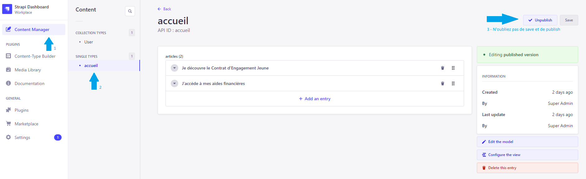

## Création d'un nouveau contenu

Lors de la création d'un nouveau `Content-Type` il faut ajouter les accès à celui-ci aux utilisateurs 
`public` (`find`) ou `authenticated` (`create`) pour qu'il soit accessible depuis le serveur.
Si un contenu doit être appelé depuis le front, l'accès sera forcément en mode public.

1. Créer un content-type :

2. Ajouter des droits :

## Exemple d'appel à l'api Strapi

Strapi fourni une api de base auto générer qui permet d'accéder à la donnée via une api
- Sans contenu `media` : http://localhost:1337/api/accueil?populate=*
- Avec contenu `media`, petit point tricky ici Strapi ne remonte pas "naturellement" les éléments
  `media` il faudra pour se faire écrire une petite query custom :
  - http://localhost:1337/api/accueil?populate[articles][populate]=*
    (on indique ici qu'on veut accéder à tous les attributs du content type accueil)
  
