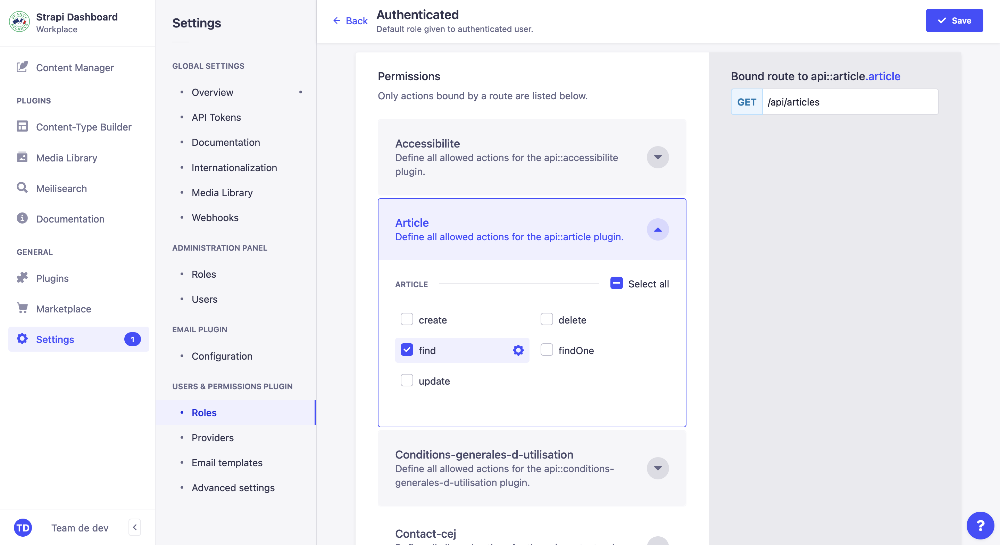

# Permissions et rôles

Il existe 2 types d'utilisateur. Les utilisateurs authentifiés et les publics. Nos appels au CMS passent par le serveur,
qui lui est authentifié auprès du CMS.

Lors de la création d'un nouveau `content-type` ou d'un nouvel environnement, il est indispensable de donner les bonnes
permissions aux `content-types` existants ou nouveaux afin de lire, créer ou supprimer de la donnée.
En général, beaucoup nécessitent la permission `find` du rôle **Authenticated** (Settings -> User & permissions plugin /
Roles -> Authenticated). Les éléments envoyés depuis le serveur vers le Strapi eux nécessiteront la permission `create`,
comme les demandes de contacts et entreprises.

